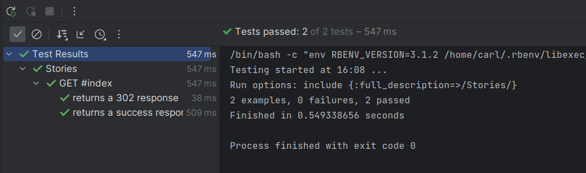

# Dokumentation Dreamweaver

## Rails App

Scaffold für eine neue Rails-Applikation erstellen mit:  `rails new dreamweaver -j esbuild --css bootstrap`.

## MVC Scaffolding

Rails Model-, Controller- und View-Scaffolds mit `rails g scaffold ModelName` erstellen.

Wir haben in unserem Fall 3 Models: User, StoryFrame und Dream.

### Models

#### User

`rails g scaffold User`

Das Model User verwenden wir zusammen mit dem gem Devise um Login-Funktionalität zu erzeugen. Da die API-Calls Geld kosten, möchten wir nur dass Personen nur mit unserer Erlaubnis auf die Applikation zugreifen können.

Wir haben Email und ein verschlüsseltes Passwort um die Authentisierung zu ermöglichen.

##### Datenbankmodell

```ruby
  create_table "users", force: :cascade do |t|
    t.string "email", default: "", null: false
    t.string "encrypted_password", default: "", null: false
    t.string "reset_password_token"
    t.datetime "reset_password_sent_at"
    t.datetime "remember_created_at"
    t.datetime "created_at", null: false
    t.datetime "updated_at", null: false
    t.index ["email"], name: "index_users_on_email", unique: true
    t.index ["reset_password_token"], name: "index_users_on_reset_password_token", unique: true
  end
```

#### Dream

`rails g scaffold Dream`

Das Model Dream verwenden wir um unsere Geschichte zu Speichern. Das Feld `title` verwenden wir um den Titel einer Geschichte zu Speichern, `story` um die Geschichte zu Speichern.

In der ersten Version war in diesem Model alles vorhanden. Das Feld `links` wurde verwendet um die Links zu den von DALLE-2 erstellten Bildern zu speichern. Da die Links aber nach einiger Zeit nicht mehr gültig waren, mussten wir uns für die zweite Version eine bessere Lösung ausdenken.

##### Datenbankmodell

```ruby
create_table "dreams", force: :cascade do |t|
    t.text "story"
    t.datetime "created_at", null: false
    t.datetime "updated_at", null: false
    t.string "title"
    t.text "links"
  end
```

#### StoryFrame

`rails g scaffold StoryFrame`

Das Model StoryFrame wurde in der zweiten Version hinzugefügt um eine ausgeklügeltere Lösung zu realisieren. Mit StoryFrame speichern wir jede der sechs Frames einer Geschichte und verknüpfen sie mit einer `belongs_to` ActiveRecord-Relation mit `Dream` .

Diese Lösung erlaubt uns auch die erzeugten Medien direkt mit ActiveStorage, das integrierte Medienspeicherungsmodul von Rails, für jedes Frame zu Speichern. In der zweiten Version war das nur Bilder und in der dritten Version folgte Audio.

###### Model-Code

Hier sehen wir die definition der Speicherung von den zwei Attachments Image und Audio in ActiveStorage.

```ruby
class StoryFrame < ApplicationRecord
  has_one_attached :image
  has_one_attached :audio
  belongs_to :dream
end
```

##### Datenbankmodell

```ruby
  create_table "story_frames", force: :cascade do |t|
    t.text "frame"
    t.datetime "created_at", null: false
    t.datetime "updated_at", null: false
    t.integer "dream_id", null: false
    t.index ["dream_id"], name: "index_story_frames_on_dream_id"
  end

```

### Controller

#### StoriesController

###### Authentisierung

Damit man nicht auf die Routen der Applikation zugreifen kann ohne sich authentisiert zu haben, ist am Anfang des Controllers eine before_action Klausel definiert. Somit kann keine Methode auf dem Controller ausgeführt werden ohne sich zuerst zu Authentisieren:

```ruby
before_action :authenticate_user!
```


Wir haben im `routes.rb`  unsere Stories#Index Route als unsere Root-Route gesetzt, daher ist der StoriesController sozusagen unserer Hauptcontroller.

Die Index-Methode ist leer, da wir von der View direkt entweder auf den DreamController oder an die Show-Methode des Stories-Controller weiterleiten. 

##### Show-Methode

In der Show-Methode steckt die Hauptverarbeitung des User-Inputs und die Wiederausgabe in die Views.

Als erstes erstellen wir die vom `openai-ruby` gem eingeführten Client für unsere API-Calls and ChatGPT und DALLE-2.

mit dieser Zeile senden wir den ersten Request an Chat-GPT:

``` ruby
response = client.chat(
      parameters: {
        model: "gpt-3.5-turbo", # Required.
        messages: [{ role: "user", content: "Imagine you are telling a fantasy visual story with 6 frames that has a start and an end. Can you give these 6 frames as 6 gener
        ative image prompts? Be detailed when it comes to visuals such as describing a person and be coherent over the 6 frames. Dont use the word Frame: at the beggining of the description of a frame. Just give me these frames and nothing else."}], # Required.
        temperature: 0.7,
      })
@story = response.dig("choices", 0, "message", "content")
```

Hier werden die 6 Frames erstellt die Später an DALLE-2 weitergeschickt werden und wir speichern sie in der variable `@story` .

In dieser Zeile entfernen wir einer der zwei Newline-Characters damit die spätere verarbeitung einfacher wird.

```ruby
@story = @story.gsub("\n\n", "\n")
```

Mit unserem zweiten Request an ChatGPT erstellen wir für die Geschichte einen Titel basiert auf den Inhalt von unserem ersten Request.

```ruby
title_response = client.chat(
  parameters: {
	model: "gpt-3.5-turbo", # Required.
	messages: [{ role: "user", content: "Create a title for this story: #{@story}"}], # Required.
	temperature: 0.7,
  })
  
title = title_response.dig("choices", 0, "message", "content")
```

Da ChatGPT uns die Geschichte nummeriert und als ein grosser String ausgibt, splitten wir es anhand von Newlines und entfernen die Nummerierung. Dies erlaubt uns später auch den Text zu den einzelnen Frames zu StoryFrames zuzuteilen.

```ruby
@split_readable_story = readable_story.split("\n")
    line = 0
    numbering = 1
    @split_readable_story.each do |i|
      @split_readable_story[line] = i.gsub("#{numbering}. ", "")
      line += 1
      numbering+= 1
end
```

Da wir jetzt die Texte generiert haben, können wir für unsere Geschichte Bilder generieren.

```ruby
@dalle_urls = []
    (0..5).each do |i|
      prompt = "#{@split_story[i]} expressive oil painting."
       puts prompt
       picture_response = client.images.generate(parameters: { prompt: prompt, size: "256x256" })
       @dalle_urls.push(picture_response.dig("data", 0, "url"))
       puts @dalle_urls
    end
```

Mit einem Loop senden wir den Text der einzelnen StoryFrames als API-Requests an DALLLE-2 mit. Wir speichern die Links die wir als Resultat erhalten in einem Array.

Im Letzten Abschnitt der Controller-Methode erstellen wir ein Dream-Objekt. Diesem Dream teilen wir den Titel und die Links zu. Im Loop erstellen wir sechs Mal einen neuen StoryFrame, senden ein Request an Elevenlabs um Audio zu generieren, Laden das zum StoryFrame dazugehörige Bild herunter und Speichern schlussendlich all dies auf dem Frame.

```ruby
   dream = Dream.new(title: title, story:@split_readable_story.to_json, links: @dalle_urls.to_json)
    (0..5).each do |i|
      frame = dream.story_frames.new(frame: @split_readable_story[i])
      ElevenlabsService.call(frame, @split_readable_story[i])
      url = @dalle_urls[i]
      file =  URI.parse(url).open
      frame.image.attach(io: file, filename: "image#{i}.jpg")
      frame.save
    end
    dream.save
    @dream = Dream.last
```


#### DreamsController

Auf dem DreamsController ist nicht viel definiert sondern wir geben eigentlich im Index und im Show nur variablen weiter. So sollte es eigentlich in einem Controller grundsätzlich auch sein, aber wegen der begrenzten Zeit wurde beim StoriesController um Zeit zu sparen, die Logik "vor Ort" umgesetzt.

``` ruby
class DreamsController < ApplicationController

...

 def index
    @dreams = Dream.all
  end

  # GET /dreams/1 or /dreams/1.json
  def show
    id = params[:id]
    @dream = Dream.where(id: id).first
    @split_story = JSON.parse(@dream.story)
    @dalle_url = JSON.parse(@dream.links)[0]
    @dalle_urls = JSON.parse(@dream.links)
  end

...

end
```

### Views

#### Stories

##### Navbar

Für die Navigation wurde eine transparente Navbar erstellt. Die erscheint auf allen Seiten der Webapplikation im oberen bereich des Screens. Er wird nur angezeigt wenn der User effektiv eingeloggt ist. Die Navbar is als Partial definiert, so dass sie mehrere mal wiederverwendet kann in verschiedenen Views. Dies entspricht dem DRY-Prinzip.

```haml
- if user_signed_in?
  %nav.navbar.navbar-expand-lg.navbar-light.bg-transparent
    %a.navbar-brand.mx-5{href: "/"}= image_tag('dreamweaver_logo_transparent.png', class: 'logo',style: "width:50px")
    %p.navbar-brand.text-white.dreamweaver-logo.mt-3 Dreamweaver
    %button.navbar-toggler{"aria-controls" => "navbarSupportedContent", "aria-expanded" => "false", "aria-label" => "Toggle navigation", "data-target" => "#navbarSupportedContent", "data-toggle" => "collapse", type: "button"}
      %span.navbar-toggler-icon
    #navbarSupportedContent.collapse.navbar-collapse
      %ul.navbar-nav.mr-auto
        %li.nav-item.active.mx-5
          = link_to "Home", root_path(), class: "top-nav-links"
```


### Index

Auf der IndexSeite wird der Anwender nach dem Einloggen als erstes Begrüsst. Zentriert sehen wir ein Slogan und unten zwei Buttons. Der linke Button "Storytime" führt uns zu Show-Page und zur Generation einer neuen Story und mit dem rechten Button "Redream" kann man auf die Dream#Index page gehen um dort schon existierende Geschichten wiederzuerleben.

Um einen Coolen zu erzeugen ist in der oberen Hälfte inline Javascript. Es hat leider nicht in einem separaten File funktioniert und da wir begrenzt Zeit hatten für die Implementation blieben wir bei dieser Lösung.

```haml
:javascript
  document.addEventListener('mousemove', function(event) {
    console.log("mouse move");
    var windowWidth = window.innerWidth;
    var windowHeight = window.innerHeight;

    var mouseXpercentage = Math.round((event.pageX / windowWidth) * 100);
    var mouseYpercentage = Math.round(((event.pageY -80) / windowHeight) * 100);

    var radialGradient = document.querySelector('.radial-gradient');
    radialGradient.style.background = 'radial-gradient(at ' + mouseXpercentage + '% ' + mouseYpercentage + '%, #fb7900, #2D59FA)';
  })

#title-container.radial-gradient
  = render partial: "navbar"
  %p.notice.py-1= notice
  %p.alert= alert
  #inner-title-container
    .h1.welcome-title Welcome to a new kind of story telling
    .button-container
      = button_to "Storytime", storytime_show_path(), method: :get, class: "btn btn-primary btn-large main-buttons"
      = button_to "Redream", dreams_path(), method: :get, class: "btn btn-primary btn-large main-buttons"


```


#### Dreams

##### Index

Auf der Index-Seite listen wir alle Dreams in "Karten" / Container auf. Diese Container beinhalten den Titel der gespeicherten Geschichte und das erste Bild als Titelbild. Mit dem Button im unteren Bereich des Containers kann man auf die Show-Seite weitergehen.

```haml
.background-container
  = render partial: "navbar"

  .h1.text-center.my-3 Redream
  .h2.text-center.my-3 Redream your own dreams or see what others have dreamt

  .container-fluid
    .row
      - @dreams.each do |i|
        .col-12.col-md-6.col-lg-4.col-xl-3
          .card.my-5.dream-card
            .card-header.bg-dark.text-white
              - unless i.title.nil?
                = i.title
            .card-body.dream-body
              - unless i.links.nil?
                %img.card-picture#test{alt: "dalle pic", src: "#{JSON.parse(i.links)[0]}"}/
              = button_to "redream this", dream_path(i.id), method: :get, class: "btn btn-primary my-3 dream-buttons"
```

### Show

Die Show-Seite macht nichts ausser zwei Partials aufrufen: die Navbar und die HAML-Darstellung einer gespeicherten Story. Wir geben die im Controller definierten Variablen hier an das Partial als locals weiter.

```haml
.background-container
  = render partial: "navbar"
  = render partial: "story", locals: {split_story: @split_story, dalle_url: @dalle_url, dalle_urls: @dalle_urls, dream: @dream}
```

### Story

Im Story-Partial erstellen wir das User-interface für das Erleben der Story. Zentral ist das Bild plaziert und unter dem Bild sehen wir die StoryFrame in Textform. Wir haben ein Button um zum nächsten StoryFrame weiterzugehen und unter diesem Button befindet sich ein Audioplayer. Dieser Audioplayer spielt die Stimme des Erzählers, also das Audio das von Elevenlabs generiert wurde.

```haml
%div.picture.mt-3
  %img#test{alt: "dalle pic", src: url_for(@dream.story_frames.first.image), style: "width: 700px; height: 700px"}/
  .p.my-4#story-text
    = split_story[0]
  %button.btn.btn-primary.dream-buttons#next-button Next Frame
  %audio.mt-2#audio-player{controls: "", autoplay: "autoplay"}
    %source#audio{src: url_for(@dream.story_frames.first.audio), type: "audio/mpeg"}
  .debug-container
    - split_story.each do |i|
      .p.line-text
        = i
    - @dream.story_frames.each do |i|
      .p.picture-links
        = url_for(i.image)
    - @dream.story_frames.each do |i|
      .p.audio-links
        = url_for(i.audio)
```


### ElevenLabs Service

Für die ChatGPT und DALLE-2 Request konnten wir ein Gem verwenden der uns einen Client gibt. Um bei ElevenLabs einen Text an die API zu senden und eine Stimme zurückzukriegen mussten wir einen eigenen Service schreiben.

Wir definieren zuerst die Konstanten des Services, nämlich URL und die Headers.

```ruby
  API_URL = "https://api.elevenlabs.io/v1/text-to-speech/evhAppD5SVsfQtTIPhyF"
  HEADERS = {
    "Accept" => "audio/mpeg",
    "Content-Type" => "application/json",
    "xi-api-key" => Rails.application.secrets.elevenlabs[:api_key]
  }

```

Danach wurde der call definiert denn wir ausserhalb dieses Services aufrufen um unser erwartetes Returnobjekt zu erhalten.

Der Mitgegebenene Text wird an ElevenLabs geschickt und der response den wir kriegen speichern wir auf dem mitgegebenen story_frame mit einer Methode die wir weiter unten definieren.

```ruby
def self.call(story_frame, text)
    data = {
      text: text,
      model_id: "eleven_monolingual_v1",
      voice_settings: {
        stability: 0.5,
        similarity_boost: 0.5
      }
    }

    response = send_api_request(data)
    attach_audio_to_story_frame(response.body, story_frame)
  end
```


Die methode `send_api_request`  sendet mit einem HTTP-Post Request die Data mit den Headers an die ElevenLabs API Endpoint.

```ruby
  def self.send_api_request(data)
    uri = URI(API_URL)
    http = Net::HTTP.new(uri.host, uri.port)
    http.use_ssl = true

    request = Net::HTTP::Post.new(uri.path)
    request.body = data.to_json
    HEADERS.each { |key, value| request[key] = value }

    http.request(request)
  end
```

Mit der Methode `attach_audio_to_story_frame` speichern wir mit einem ActiveRecord attachment die Audiodatei an die StoryFrame die dem Service-Call mitgegeben wurde.

## Testing

### Aufgabentests

Es wurden 5 Issues erstellt und in unseren Zeitplan eingetragen:

1. Create Models
2. Create Routes
3. Create Views
4. Create a Service for ChatGPT API Requests
5. Create a Service for DALLE API Requests

Die ersten 3 Aufgaben und somit das Grundgerüst der Applikation wurde Zeitgemäss umgesetzt. Somit wurden diese Aufgaben erfüllt.

Die Letzten 2 Aufgaben, Create a Service for ChatGPT APU Requests und DALLE API Requests wurden schlussendlich nicht umgesetzt da sich während weiterer Recherche ergeben hat, dass ein Gem vorhanden ist `openai-ruby`, dass diese services schon beinhaltet.

### Technische Tests

Für das testen des Codes wurde White-Box-Testing in form von Unit tests ausgeführt. In Rails wird entweder mit Mini-Tests oder RSpec gearbeitet. MiniTest ist schon eingebaut und ist lightweight. Es hat mit komplexeren Tests aber seine Einschränkungen und in diesem Fall wird RSpec empfohlen. 

Wir haben uns für RSpec entschieden da Carl da mehr Erfahrung hat

Wir Beschränken uns im Request-Spec auf die Index-Seite, da die Show-Seite mit Api-Calls in dieser Zeit sehr aufwändig ist zu testen.

Wir haben zwei Tests:

1. Wir testen das anfragen der Seite ohne eingeloggt zu sein 
2. Wir testen das anfragen der Seite nach dem wir uns eingeloggt haben

Der erste Test sollte eine :302 Response code zurückgeben. Normalerweise würden wir eine 401 erwarten (unauthorized) aber mit dem gem Devise wird bei requests eine :302 zurückgegeben wenn man einen request macht ohne eingeloggt zu sein. Darum testen wir auf diesen status code.

Wir testen somit auch das keine false positives durchkommen, also jemand die Seite ohne eingeloggt requesten kann.

Beim zweiten Test erwarten wir ganz normal einen 200 code. Daher testen wir auf das.

Wir testen hier somit auch nach false negatives, also das jemand der korrekt eingeloggt ist nicht auf die Ressource zugreifen kann obwohl er können sollte.


```ruby
RSpec.describe "Stories", type: :request do

	describe 'GET #index' do
	 let(:user) { create(:user) }
	  it 'returns a 302 response' do
	  get storytime_path() expect(response).to have_http_status(302) 
	end 
	
	  it 'returns a success response' do
	   sign_in user get storytime_path() expect(response).to  have_http_status(:success) 
	   end
	end 
end
```


### Resultate

Die zwei Tests sind beide erfolgreich. Wir wissen somit dass unse User-Authentitisierung korrekt funktioniert.

